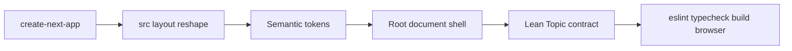

# Phase 1A — Product Foundation

The repo is docs-only today: [docs/project_plan.md](docs/project_plan.md), [.cursor/rules](.cursor/rules), and two approved concepts in [reference-concept-pages/](reference-concept-pages/). There is no Next.js app, lockfile, or `src/`. This phase is **Step 1** of Phase 1 only.

**Out of scope:** landing UI, conversation UI, auth, admin, database, APE integration, state libraries, dark-mode toggle, shadcn/component library, and speculative folders (`src/server/`, unused `src/shared/`).



---

## 1. Initialize Next.js in this repo

Use the official generator in the existing git repo (do not re-init git):

```bash
npx create-next-app@latest . --typescript --tailwind --eslint --app --src-dir --import-alias "@/*" --react-compiler --use-npm --disable-git --empty --yes
```

If the non-empty directory is rejected, scaffold in a temp folder with the same flags and copy the generated app files in, preserving `.cursor/`, `docs/`, `reference-concept-pages/`, and `.git`.

Expected stack (current `create-next-app` defaults, ~Next.js 16):

- App Router, `src/`, TypeScript **strict**
- Tailwind CSS v4 (CSS-first, no `tailwind.config.ts`)
- ESLint 9 flat config (`eslint.config.mjs`) with `eslint-config-next`
- React Compiler on (`reactCompiler: true` in `next.config.ts`)
- Turbopack for `next dev`

Then:

- Set `"lint": "eslint ."` (normalize the generated script if it differs)
- Add `"typecheck": "tsc --noEmit"`
- Confirm `tsconfig.json` has `"strict": true` and `@/*` → `./src/*`
- Keep the generated `.gitignore`; do not add APE/env secrets
- If the generator adds `AGENTS.md`, leave it as Next.js tooling guidance only — do not copy product architecture into it
- Remove starter demo copy/assets that conflict with OmniAskAI

**Do not add:** Prettier, Jest/Vitest, shadcn, Redux/Zustand/TanStack Query, `next-themes`, APE SDK.

---

## 2. Folder reshape (feature-first, no empty layers)

After generate, keep framework files thin and add folders **only where there is real code**:

```text
src/
  app/                 # layout.tsx, page.tsx, globals.css
  features/
    topics/            # types, sample catalog, read helpers
public/
docs/features/         # topics feature doc
```

Do **not** create `src/server/` or `src/shared/` until something actually lives there. Do **not** add `utils.ts` / `data.ts`.

---

## 3. Semantic design tokens (minimal)

Tokens live in [src/app/globals.css](src/app/globals.css) via Tailwind v4 `@theme` / `:root`. Keep this a small semantic base the later pages can extend — do not invent a full design system before landing and conversation exist.

Define only:

- **Color:** `background`, `surface`, `foreground`, `muted`, `border`, `brand`
- **Fonts (next/font):** **Inter** for Latin plus **Noto Sans Bengali** as the Bangla fallback, wired on `<body>`

Do **not** pre-specify radius scales, shadow tokens, type scales, layout max-widths, topic accent palettes, or topic CSS variable helpers. Those belong with the pages that need them.

**Also not in 1A:** dark-mode class strategy, glassmorphism utilities, icon packs, 3D artwork.

---

## 4. Minimal application shell (not the landing, not the workspace)

The two approved concepts do **not** share chrome. 1A only ships **document chrome**.

[src/app/layout.tsx](src/app/layout.tsx):

- `html lang="en"`
- font CSS variables + `antialiased`
- skip-to-content link → `#main`
- baseline metadata: title template `%s · OmniAskAI`, short description
- `<body>` applies canvas/text tokens

[src/app/page.tsx](src/app/page.tsx) — **temporary foundation page**, replaced in Step 2:

- Server Component
- Logo wordmark (simple mark + “OmniAskAI”) — no marketing nav, login, or CTAs
- One English line + one Bangla line to prove the font stack
- Does **not** render topic cards, hero, how-it-works, or conversation UI

No shared UI kit. Colocate the wordmark in `app/` if needed.

---

## 5. Lean static Topic contract (DB-replaceable)

Own this under `src/features/topics/`. Same function names later swap from a static array to a database.

**Type — product Topic, not an APE Project.** Only fields Phase 1A needs as a stable identity/catalog:

- `id`, `slug`, `title`, `subtitle`
- `status: "published" | "draft"`
- `sortOrder`

**Defer until a later step actually needs them:** source/collection stats, last-updated, badges, taglines, suggested questions, landing previews, citation labels, image paths, topic accent, and APE project mapping.

**Catalog:** four published sample topics matching the concepts — Income Tax, Literature, Bangladesh History, Movies & Culture.

**Reads (no service/repository layer):**

- `getPublishedTopics()` — published only, `sortOrder`
- `getTopicBySlug(slug)` — `Topic | undefined`

No theme wrapper, no CSS variable mapper, no cards.

---

## 6. Docs (keep current, not a changelog)

- Add [docs/features/topics_feature.md](docs/features/topics_feature.md): purpose, lean contract, read helpers, Topic vs APE Project boundary, swap-to-DB note, verification
- Update [.cursor/rules/context.mdc](.cursor/rules/context.mdc): real `src/` tree, current focus = foundation complete / next = landing, topic data = static sample module

Do not add landing/conversation feature docs until those steps.

---

## Acceptance criteria

- App runs with `npm run dev`; `/` is a branded foundation page, **not** the landing or conversation concepts
- Semantic tokens and fonts are used on the shell; Bangla text renders with the Bengali font
- Topic module compiles; four published topics; `getTopicBySlug` works
- Topic type has no landing/workspace/APE-only fields
- No `'use client'` except if a generator leftover is removed
- No auth, admin, DB, APE, landing UI, conversation UI, state libraries, or empty speculative folders
- `docs/features/topics_feature.md` and `context.mdc` match the tree

## Verification

1. `npm run lint` → `eslint .`
2. `npm run typecheck`
3. `npm run build`
4. Browser: `/` at ~1280px and ~375px; fonts load; no console errors; skip-to-content works
5. Spot-check: placeholder is obviously not the approved landing or conversation pages
