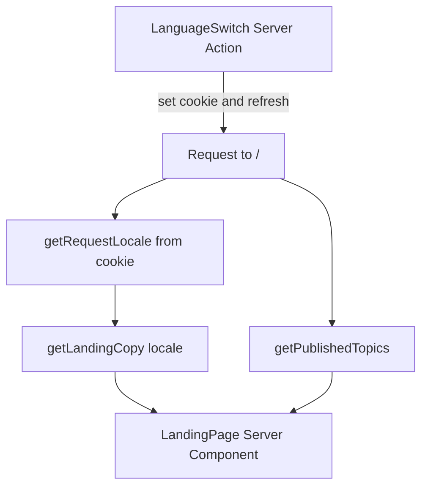

# Phase 1B — OmniAskAI Landing Experience

Replace the temporary foundation page with the approved marketing landing. Keep Phase 1A’s document shell, fonts, tokens, and static Topic catalog. Do not add auth, admin, subscriptions, a database, or APE.

**Primary visual target:** the approved reference is **1024px wide**. Implement and compare at 1024 first. Also check ~1280, ~1440, tablet, and ~375. The Cursor IDE Browser is often narrower than a normal desktop — set the viewport explicitly; do not treat a squeezed IDE pane as “desktop.”



---

## What to reuse from Phase 1A

- **App shell:** [src/app/layout.tsx](src/app/layout.tsx) — Inter + Noto Sans Bengali, skip link, metadata template. Make the layout async so `html lang` follows the request locale.
- **Tokens:** [src/app/globals.css](src/app/globals.css) — extend the existing semantic set (`background`, `surface`, `foreground`, `muted`, `border`, `brand`). Do not invent a full design system.
- **Topics:** [src/features/topics/](src/features/topics/) — keep the lean `Topic` contract. Landing reads `getPublishedTopics()`. Do not put artwork, accents, mock-chat, or bilingual fields on `Topic`.
- **Fonts:** already correct for mixed English/Bangla. Do not add another typeface.
- **Assets:** use the files already under [public/](public/). Do not rename or replace them.
- **Scripts:** `npm run lint` / `typecheck` / `build`; dev server on port **3011**.

Thin [src/app/page.tsx](src/app/page.tsx): resolve locale + copy + topics, then render a landing composer. No marketing markup in the route file.

---

## Supplied assets

```text
public/brand/omniaskai-logo.png

public/landing/
  omniaskai-hero.png
  omniaskai-knowledge-portal-cta.png

public/topics/
  topic-income-tax.png
  topic-literature.png
  topic-bd-history.png
  topic-movie-culture.png
```

| File | Inspected | Use |
| --- | --- | --- |
| `/brand/omniaskai-logo.png` | 1254×1254 RGBA, real alpha | Header mark (~36px) and favicon. Transparent center is safe on white. |
| `/landing/omniaskai-hero.png` | 1448×1086 RGB, ~1.7MB | **Hero right visual.** Complete orb + four topic cards. Do not CSS-compose logo/topic thumbs. |
| `/landing/omniaskai-knowledge-portal-cta.png` | 1774×887 RGB, ~1.3MB, left-weighted | **Final CTA illustration**, sized inside a **reference-height band** (see CTA section). Do not let this 2:1 file dictate section height. |
| Topic PNGs | 1536×1024 RGB, ~1.7–2.4MB, left-weighted | **Full-card background** for each topic card. Overlay real HTML. |

Map topic files to slugs in presentation (do not rename files):

- `income-tax` → `/topics/topic-income-tax.png`
- `literature` → `/topics/topic-literature.png`
- `bangladesh-history` → `/topics/topic-bd-history.png`
- `movies-culture` → `/topics/topic-movie-culture.png`

**Hero image:** copy left / artwork right at roughly **42% / 58%**, not 50/50. Show the full hero PNG with `object-fit: contain` in the artwork column. It is one image, not clickable topic cards. Topic navigation lives in the HTML grid below. Preserve the reference headline wrapping and the trust-row (avatars / rating / three checks) composition.

**CTA image:** match the **reference band’s height and roundness first**. Place the illustration in the left of that band (`object-position` toward the portal/books). Do not stretch the section to the PNG’s native aspect ratio. The file’s right-side empty field is unused once HTML occupies the right of the band.

---

## Remaining visuals — judge before adding assets

All primary illustrations for 1B are supplied. For anything else:

1. Prefer existing PNGs, inline SVG, or CSS.
2. If that would materially miss the concept, name the exact missing asset. Do not invent a generic placeholder.

| Element | 1B decision |
| --- | --- |
| Feature row (shield, search, globe, lock) | Inline SVG in `landing-icons.tsx` |
| How-it-works steps | Inline SVG; dashed connector in CSS |
| Trust-bar checks, CTA arrows, play glyph | Inline SVG |
| Social-proof faces | **CSS gradient discs** — enough for the row rhythm. Do not use stock photos. |
| Hero 3D scene / CTA portal / topic art | **Supplied.** No further bitmaps. |

Do not add `lucide-react`.

---

## Locale (lightweight, SSR-safe)

No `next-intl` / `formatjs` / `negotiator`. Cookie + Server Action matches Next.js 16 [`cookies()`](node_modules/next/dist/docs/01-app/03-api-reference/04-functions/cookies.md) (async; set only in a Server Function).

```text
src/lib/locale/
  locale.ts                 Locale = "en" | "bn", default "en", guard
  get-request-locale.ts     await cookies(); fallback default
  set-locale.ts             "use server"; validate; set cookie; refresh
  language-switch.tsx       segmented EN | বাং control; consumes labels, not locale logic
```

```text
src/features/landing/
  landing-language.ts       LandingCopy type + en/bn dictionaries
  get-landing-copy.ts       getLandingCopy(locale) → LandingCopy
```

Rules:

- Components receive **resolved `copy`**. No `locale === "bn"` branches in UI.
- **No user-facing strings in components** (aria, buttons, headings, mock chat, source chips, topic titles/subtitles/source counts as shown on the landing).
- **Do not make `Topic` bilingual.** Identity stays `id` / `slug` / `title` / `subtitle` / `status` / `sortOrder` as catalog fields. Landing display strings (localized title, subtitle, source-count label, preview Q/A, source chips, Explore label, badges) live in `landing-language.ts` keyed by slug.
- Switch is a **form posting to `setLocale`** so first paint is cookie-correct and the control can stay a Server Component.
- Cookie: `omniaskai_locale`, `path=/`, `sameSite=lax`, `maxAge` ~1 year, `httpOnly`.
- Default **`en`** when the cookie is missing. Do not add `Accept-Language` or `/en`/`/bn` routes in 1B.
- Root layout sets `<html lang={locale}>`. `generateMetadata` on `/` uses the same locale copy.

**Switcher placement:** header right cluster, always visible when the compact menu is showing: `[EN | বাং]` plus auth chrome. Compact pill: current locale filled, the other ghost.

**Accepted cookie SSR/SEO tradeoff:** one URL (`/`) with cookie language. The first HTML response is locale-correct for that request (no client flash). Crawlers without the cookie will mostly index **English**. Duplicate-language URLs and `hreflang` are a later SEO step, not 1B. This is an accepted limitation, not a bug to “fix” with a heavy i18n library.

Future pages add `src/features/<feature>/<feature>-language.ts` and call `getRequestLocale()`. They do not change `src/lib/locale/`.

---

## Landing structure and component boundaries

Feature-owned, named files. Server Components by default. One Client Component only if mobile nav cannot be done accessibly with `<details>` / CSS.

```text
src/features/landing/
  landing-page.tsx              section composer
  landing-language.ts
  get-landing-copy.ts
  site-header.tsx               logo, in-page nav, language switch, non-functional auth chrome
  site-header-menu.tsx          Client only if needed for mobile overlay
  landing-hero.tsx
  landing-hero-visual.tsx       next/image of omniaskai-hero.png (contain, full frame)
  landing-topic-grid.tsx
  topic-knowledge-card.tsx      full-bleed art + HTML overlay (not a split pane)
  landing-feature-row.tsx
  landing-how-it-works.tsx
  landing-final-cta.tsx         constrained-height band; illustration positioned inside
  site-footer.tsx
  landing-icons.tsx             small inline SVGs used on this page
```

```text
src/features/topics/
  topic-presentation.ts         artworkSrc + accent only — not copy
```

`Topic` stays `{ id, slug, title, subtitle, status, sortOrder }`. Presentation maps slug → artwork + accent. All landing-facing text is in `landing-language.ts`. Preview Q/A stay **the same in both locales** so cards keep the reference’s mixed English / Bangla / Banglish samples.

**In-page nav:** **Topics** → `#topics`, **How it works** → `#how-it-works`. Those sections exist in the concept.

**Pricing / About:** they appear in the reference **header** only. Keep them as visually honest, **non-functional** header items (same treatment as auth — not `href="#"`). **Do not** invent Pricing/About page sections or footer blocks just to give the labels a destination. That UI is absent from the approved concept.

### Auth chrome (non-functional, not fake links)

Render Log in and Create Free Account so the header matches the concept, but they must not pretend to navigate:

- Use **`<button type="button" disabled>`** (or `aria-disabled="true"` on a non-submitting button), with copy-driven accessible names.
- **Do not** use `href="#"`, `/login`, `/signup`, or hash no-ops.
- Do not add auth routes. Do not attach click handlers that go nowhere.
- Keep them visually on-model; disabled styling may be slightly muted so they read as unavailable rather than broken links.

### `/topics/[slug]` — strictly minimal (not Phase 1C)

Explore / Browse Topics may link here so discovery does not 404. The page is **only**:

- `getTopicBySlug`; unknown slug → `not-found`
- Topic title + subtitle (catalog fields are fine on this stub)
- Back link to `/`

Out of scope on this route: conversation UI, composer, citations, artwork hero, mock chat, suggested questions, topic chrome, or layout that anticipates the workspace. One small route file is enough.

---

## Visual implementation (match the 1024px concept)

Treat [reference-concept-pages/omniaskai-landing-page.png](reference-concept-pages/omniaskai-landing-page.png) as the baseline. Compare against it at **1024px width**. Where a supplied PNG *is* the concept visual (hero, closing CTA, topic backgrounds), follow the asset and overlay HTML; do not reconstruct those illustrations.

Use **CSS Grid / Flex** and content-fit breakpoints. Do not hardcode pixel coordinates for the hero cards or overlay. Avoid layout shift and horizontal overflow.

### Page frame

- White canvas; How-it-works band uses a new `--surface-muted` (~`#f7f8fa`).
- Content width should match the reference’s airy margins at 1024 (not a cramped full-bleed toolbar, not an oversized 1440-first container). Tune against the PNG rather than assuming ~1120–1200.
- Soft page atmosphere may use light CSS radial blobs **behind** the hero, not as a substitute for `omniaskai-hero.png`.

### Header

- Logo image + “OmniAskAI” wordmark (replace the 1A CSS circle).
- **Airy**, like the concept. Sticky is fine for long-page anchors (`scroll-padding-top`), but **no prominent toolbar border or drop shadow**.
- Center nav only when **nav + language switch + auth chrome all fit without crowding**. Until then, use the compact/mobile menu. Do not force desktop nav at 1024 if the row wraps or collides — but prefer showing the reference header at 1024 if it actually fits.
- Language switch is the only intentional interactive chrome addition to the concept header.

### Hero (~42% copy / 58% artwork)

- Pill badge, large tight headline (preserve reference line breaks as closely as practical), supporting paragraph, primary + ghost CTAs, rating row, three-item trust bar with checks under the columns.
- Right visual: `omniaskai-hero.png`, `contain`, full frame — no orb-only crop.
- At **1024**, keep the **two-column** hero. Stack only when the copy column would crush wrapping or the artwork would crop.

### Topic cards (full-bleed background + overlay)

Not a left-image / right-panel split. Each card is one rounded surface:

- Topic PNG as **full-card background** (`next/image` fill, `object-fit: cover`, object-position toward the left-weighted cluster so the 3D still life reads).
- **Overlay HTML:**
  - **Left:** title, subtitle, source count
  - **Right:** glass conversation preview
  - **Bottom-right (desktop):** Explore CTA — **not** full-card width. Source count stays left; CTA aligns under / with the right edge of the conversation panel.
  - **Mobile:** stacking is fine; Explore **may** be full-width.
- Selective **gradients/scrims** only where type sits (typically left/bottom and behind the glass panel) so artwork stays visible. Do not flatten the whole card with an opaque slab.
- 2×2 grid at **1024**; 1 column when two cards cannot keep this overlay readable.
- Accents from presentation: teal (tax), purple (literature), sand (history), coral (movies).
- Income Tax “Popular” badge from copy + a presentation flag if needed (flag is not copy).

### Features / How it works / closing CTA

- At **1024:** four-column feature row; **horizontal** three-step flow with a dashed connector.
- Collapse features/steps only when columns would wrap into an unreadably narrow stack — content-fit, not “always stack below `lg`.”
- Closing band: **reference height first**; illustration positioned on the left inside that band; headline + buttons on the right. On small screens, keep the band from becoming a tall portrait of the 2:1 PNG — crop/position within the band rather than growing the section.

---

## Responsive strategy

Decide layout from **whether the reference composition still fits**, not from Tailwind habit (`md` / `lg` as destiny).

| Viewport | Expectation |
| --- | --- |
| **1024 (primary)** | Two-column hero (~42/58), 2×2 topic cards with overlay composition, 4-up features, horizontal 3 steps, CTA band at reference height. |
| ~1280 / ~1440 | Same structure; more side margin. Do not redesign; do not let the hero become 50/50 or the CTA band grow with the PNG aspect. |
| Tablet | Keep 1024 structure while it still fits; compact header if chrome crowds. Topic grid may go 1-col before features/steps do. |
| ~375 | Header: logo, language switch, menu. Hero stacks copy then full hero PNG. Topics 1-col; overlay may stack; Explore full-width OK. Features/steps stack. CTA band stays short; illustration + HTML stack inside it. No horizontal overflow. |

`prefers-reduced-motion`: no required animation on hero/CTA images; apply to scroll-smooth and any CSS blobs.

---

## Image `sizes`, positioning, performance

All bitmaps via `next/image`. Tune `sizes` against the real layout at 1024:

| Image | Loading | `sizes` guidance | Position |
| --- | --- | --- | --- |
| Logo | `priority` | `36px` | intrinsic, not cropped |
| Hero PNG | `priority` (with headline, likely LCP) | `(min-width: 1024px) 58vw, 100vw` | `contain` in the ~58% column; full frame |
| CTA PNG | lazy | roughly the **left half of the band** at 1024, `100vw` when stacked | fill/position **inside the band box**; `object-position` toward the portal; do not size the band to 1774×887 |
| Topic card art | lazy except first row if in view | `(min-width: 1024px) 50vw, 100vw` (full card, 2-col) | `cover` the **entire card**; object-position toward the still life; HTML overlay + scrims handle type |

Do not ship raw multi-MB `` tags. Do not mark all topic/CTA images `priority`. Avoid accidental cropping of **hero** (contain). Topic/CTA may cover within a designed frame — that is intentional composition, not a random crop.

---

## Implementation practice

- Server Components by default; minimal client JS (locale is a form; menu only if needed).
- Semantic HTML and accessible interactions.
- Reuse Phase 1A tokens; do not extract a generic UI kit after first use.
- Correct `sizes`, loading priority, and object positioning.
- Keyboard, focus, contrast, reduced-motion.
- Inspect **console and network** on every Browser pass.

### Section-by-section visual loop (do not wait for the whole page)

```text
reference
→ implement section
→ open in Cursor IDE Browser
→ set viewport (1024 primary; also check 375)
→ compare at target viewport
→ identify largest visual mismatch
→ fix
→ verify again
→ continue to next section
```

Recommended order:

```text
1. container / page width
2. section heights + vertical rhythm
3. hero proportions (~42/58, headline wrap, trust row)
4. topic-card composition (full-bleed + overlay + CTA placement)
5. typography + line wrapping
6. spacing / alignment
7. responsive behavior (1024, 1280, 1440, tablet, 375)
8. shadows / gradients / icons / detail polish
```

---

## Gaps vs the reference (do not fake)

| Gap | Approach |
| --- | --- |
| No user avatar photos | CSS gradient discs; keep “4.9/5” copy from the concept |
| History / movies filename ≠ slug | Map in `topic-presentation.ts` |
| Topic / landing PNGs are large RGB | `next/image` + `sizes` as above |
| Mock answer paragraphs not in code | Transcribe from the reference PNG during implementation |
| Pricing / About / auth have no destinations | Header chrome only; non-functional; **no** invented sections |
| Source counts are conceptual | Static strings in `landing-language.ts` until real stats exist |

**Do not** replace supplied artwork with generic stock, emoji, or AI-generated stand-ins.

---

## Recommendations that keep the product direction

1. **Language switch in the header** (requested) — the only intentional interactive chrome addition to the concept.
2. **Sticky header without toolbar chrome** — useful for anchors, still airy.
3. **Selective scrims on topic cards** — required for contrast without hiding the full-bleed art.
4. **Cookie locale, not URL prefixes** — simplest SSR switch; SEO tradeoff accepted (see Locale).
5. **Strictly minimal `/topics/[slug]`** — discovery without starting Phase 1C.
6. **Honest unavailable chrome** — auth / Pricing / About look like the concept but do not fake navigation.
7. Align `--brand` slightly toward the logo’s cobalt if `#5b4dff` reads too violet next to the real mark. Do not introduce a second brand color.

---

## Accessibility and performance

- Keep the skip link; `#main` wraps landing content.
- Real headings (`h1` once, then `h2` per section, `h3` per topic card).
- Language switch: `aria-label` from copy; current option `aria-pressed` or `aria-current`.
- Hero image: short descriptive `alt` from copy. CTA image: `alt=""` if adjacent HTML states the message; otherwise a short alt from copy.
- Topic-card artwork: empty `alt`; the card heading and Explore link are the accessible name.
- Disabled header items are skipped or announced as unavailable — not as links.
- Focus rings on interactive controls; tap targets on mobile.
- `scroll-behavior: smooth` only if `prefers-reduced-motion: no-preference`.
- JSON-LD `WebSite` + `Organization` on `/` (inline script, no `schema-dts`).
- Favicon via metadata `icons` pointing at `/brand/omniaskai-logo.png`.
- No extra client JS for locale. No `useMemo` / `useCallback`.

---

## Docs to update after implementation

- [docs/features/landing_feature.md](docs/features/landing_feature.md) — new, concise (purpose, locale pattern including cookie SEO tradeoff, sections, presentation vs Topic, verification).
- [docs/features/topics_feature.md](docs/features/topics_feature.md) — add presentation map; Topic contract stays lean and **not** bilingual.
- [.cursor/rules/context.mdc](.cursor/rules/context.mdc) — structure, current focus (Step 3 workspace next).

---

## Verification

Do **not** defer visual QA until every section exists. After **each** section: Browser at **1024** (and a quick 375 if the section is responsive), compare to the reference, fix the largest mismatch, then continue.

**Viewports:** 1024 (primary fidelity), ~1280, ~1440, tablet, ~375. Explicitly resize the IDE Browser; it may be narrower than a real desktop.

**Functional checks:**

1. Language: load `en`; switch to `বাং`; hard-refresh — Bangla chrome, `html lang="bn"`, no flash; switch back.
2. Topics / How it works anchors clear the sticky header.
3. Pricing / About / auth do not navigate; no `#` URL change; no extra sections.
4. Explore → **minimal** `/topics/[slug]`; unknown slug → not-found.
5. Skip link, keyboard through real controls, contrast on overlaid card type.
6. Console clean; network: images via `next/image`.
7. Disable JS: headline, topics, CTAs present; locale switch works via form POST.

### Final whole-page review (required)

After all sections are in:

```text
approved reference
vs
actual 1024px rendered screenshot
```

Walk the page top-to-bottom: hierarchy, proportions, typography, spacing, image framing, card composition, responsiveness, visual consistency. Fix meaningful differences.

Then rerun:

- `npm run lint` (`eslint .`)
- `npm run typecheck`
- `npm run build`
- desktop (**1024**, plus 1280/1440) + mobile (~375) Browser verification
- console / network
- accessibility + SEO sanity (headings, `html lang`, metadata, skip link)

---

## Acceptance criteria

- `/` matches the approved landing at **1024px**: two-column hero (~42/58), 2×2 full-bleed topic cards with overlay HTML, 4-up features, horizontal three steps, CTA band at reference height.
- Topic cards use supplied art as **full-card background**; desktop Explore is **not** full-width; source count stays left.
- Hero and CTA illustrations keep intended composition; CTA **section height** follows the reference, not the PNG aspect ratio.
- Header is airy (sticky OK, no heavy toolbar); compact menu until chrome fits.
- All landing display/aria copy comes from `landing-language.ts`; `Topic` stays lean and not bilingual; EN/BN switch is top-right, SSR-safe, cookie-persisted; cookie SEO tradeoff is documented.
- Auth / Pricing / About are visually present and clearly non-functional; no invented sections; no `href="#"`.
- `/topics/[slug]` is a stub, not a workspace. No DB/auth/admin/APE.
- Server Components by default; SEO content in the initial HTML; `html lang` matches locale.
- Section-by-section Browser compares were done during implementation, plus a final 1024px whole-page vs reference.
- Lint, typecheck, and production build succeed; console/network and a11y/SEO sanity checked.